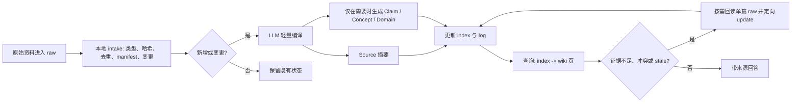

# LLM Wiki 实践调研与企业内网试点设计

> 调研日期：2026-07-15
> 目的：为本仓库从个人试验扩展到企业内网试点提供可追溯的设计依据。本文不是产品宣传，也不把开源项目或社区评论当作已被普遍验证的结论。

## 结论摘要

LLM Wiki 适合承担企业知识库的“编译层”：把不可变的产品文档、设计文档和操作指导书，持续整理为可导航、可引用、可维护的 Markdown 知识页。它不是 RAG 的替代品，也不应把全部 raw 文档塞进模型上下文。

对于上下文约 256k 的内网模型，推荐的起点是：

1. 用本地确定性程序完成文件登记、哈希、去重、版本变化检测和 manifest 更新。
2. 用 LLM 只做“有复用价值的综合”：来源摘要、跨文档规则、设计取舍、操作步骤和冲突说明。
3. 查询先读 `wiki/index.md` 和少量 wiki 页；仅在证据不足、来源变更或出现冲突时，回读单篇 raw。
4. 当 Markdown 索引不再足够时，增加本地全文或混合检索；它是派生索引层，不取代 Markdown wiki。
5. 用内部对照试验决定是否扩展，而不是凭公开项目热度或个人经验决定。

## 证据等级

| 等级 | 含义 | 本文如何使用 |
|---|---|---|
| A | 原始规范、同行评审论文、权威安全实践 | 可作为设计原则的直接依据，但仍需适配具体业务。 |
| B | 可阅读和复现的开源实现及其文档 | 证明该做法已有可操作实现，不等于效果已被独立验证。 |
| C | 社区生产报告或单项目实验 | 只作为假设和试点线索，不能单独作为立项结论。 |
| I | 基于上述材料的工程推论 | 明确标注为推论，必须由内部试点评估。 |

## 已调研结论与设计决定

| 编号 | 结论 | 对本项目的设计决定 | 证据与等级 | 边界条件 |
|---|---|---|---|---|
| 1 | LLM Wiki 的核心不是“问答时从 raw 找片段”，而是持续把 raw 编译为结构化、互链、可更新的中间知识层。 | 保留 `raw/ -> wiki/` 两层，wiki 是日常查询的首选面，raw 是证据与回源面。 | Karpathy 原始规范 [A1]，A。 | 该规范是方法论，不是企业效果评测。 |
| 2 | `schema`、`ingest`、`query`、`lint`、`index.md`、追加式 `log.md` 是 LLM Wiki 的关键运行契约。 | 维持现有 `AGENTS.md` 与 `.opencode/skills/` 的基本分工；后续只做兼容性增量，不整体替换现有技能。 | Karpathy [A1]，A；开源实现 [B3]，B。 | Schema 需要随领域演化，不能照搬其他项目的页面类型。 |
| 3 | 更长上下文不意味着模型能稳定利用全部输入；多文档任务中，关键信息处于长上下文中部时性能可能显著变差。 | 不因模型有 256k 上限就整批读取 raw；采取“索引 -> 少量 wiki 页 -> 按需单篇 raw”的逐层读取。 | 长上下文研究 [A2]，A。 | 论文结果不等同于任一内网模型的精确表现，仍需做本地基准。 |
| 4 | 文件登记、哈希、去重、文档类型判断、变更检测属于确定性工作，不该让 LLM 消耗上下文完成。 | 在 `/ingest` 前新增或调用本地 intake 步骤，自动维护 manifest 和变更报告；LLM 从清洗后的输入开始工作。 | 低 token intake 实现 [B1]，B。 | 这是可复用实现经验，不是统一标准；解析器必须针对 PDF、DOCX、XLSX 等内网格式验证。 |
| 5 | 企业知识要能回答“这句话来自哪一版哪一份资料，资料变了吗”。 | 为 source 与 claim 保存来源路径、来源版本或生效日期、SHA-256、编译时间和陈旧状态；资料变化时产出待重编译项，不静默覆盖已发布内容。 | OWASP RAG 来源归因建议 [A3]，A；开源 stale/provenance 方案 [B1]，B。 | hash 能证明内容变化，不能判断业务结论是否仍适用；仍需要责任人审核。 |
| 6 | Wiki 只有在压缩并整合了分散信息时才有价值；把易搜索的小文件机械复述成更长页面，可能增加 token。 | 不要求每份资料固定生成大量 Claim。默认产出一个短 source 摘要；只有跨文档复用、需要审计、存在规则/约束/取舍时才增加 Claim、Concept 或 Domain。 | 社区 A/B 报告 [C1]，C；Karpathy 的“跨源综合”定位 [A1]，A。 | A/B 只有单个代码库与少量问题，不能外推其具体节省比例。 |
| 7 | 中等规模可以用 `index.md` 导航；规模增长后可加入本地全文、向量和 rerank 的混合检索。 | 初期保持 Markdown + `index.md`；当索引已不能稳定定位页面时，再增加可重建的 SQLite FTS5 或 qmd 索引。 | Karpathy [A1]，A；qmd [B2]，B。 | “约 100 份来源”只是 Karpathy 的经验提示，不是通用阈值；以内部检索质量和 token 数据决定。 |
| 8 | Subagent 能隔离主 agent 上下文，但不能自动降低全流程 token；只有返回受限的结构化交接包时，主 agent 才会受益。 | 不为 intake 使用 subagent。若后续采用 subagent，只用于“候选摘要/claim/出处锚点/改动建议”的有限输出，主 agent 不接收 raw 全文。 | 社区实验报告提到 subagent 固定开销 [C1]，C；这是工程推论，I。 | 需要在内网模型、实际并发和计费方式下测量总 token、延迟与质量。 |
| 9 | RAG 仍有价值，尤其适合回读原文、长尾问题和规模化检索；但 RAG 本身并不完成跨文档结论的维护。 | 将检索层用于“找候选证据”，将 LLM Wiki 用于“沉淀经维护的结论”；回答必须可显示来源。 | RAG 原始论文 [A4]，A；Karpathy [A1]，A。 | 不应宣称 LLM Wiki 在所有任务上优于 RAG。 |

## 面向当前仓库的建议工作流

### 1. Intake：不调用 LLM 的资料治理

每个纳入知识库的文件至少登记以下字段。manifest 是机器读取的台账，不是需要在每次查询中完整送入模型的上下文。

| 字段 | 用途 |
|---|---|
| `source_id` | 稳定标识，文件改名或归档后仍可定位。 |
| `document_set_id` | 将同一产品、项目、版本的一组章节、设计文档和操作指导书关联起来。 |
| `document_kind` | 如 `product_manual`、`design_spec`、`runbook`、`meeting_note`。 |
| `authority_level` / `owner` | 标记正式发布、草案、经验文档及其责任方。 |
| `version` / `effective_date` | 表示文档业务版本与生效时间。 |
| `source_original_path` / `source_current_path` | 支持 raw 归档后仍可回源。 |
| `source_sha256` | 检测正文是否改变，支持 stale 判断。 |
| `status` | 如 `new`、`compiled`、`stale`、`retired`。 |
| `compiled_pages` / `last_compiled_at` | 记录该来源已编译到哪些 wiki 页、最后处理时间。 |

### 2. 轻量编译：按“知识价值”而不是文件数输出

| 资料类型 | 默认产物 | 只有满足以下条件时才加深编译 |
|---|---|---|
| 分割的产品手册章节 | Source 摘要，链接所属产品或功能页。 | 有明确限制、兼容性、风险、版本差异，或被多个场景复用。 |
| 完整设计文档 | Source 摘要，目标、约束、方案、取舍、未决项。 | 方案影响多个组件，或与其他设计产生冲突/依赖。 |
| 操作指导书 | Source 摘要，前置条件、步骤、验证、风险、回滚。 | 形成稳定操作规则、故障边界或跨系统依赖。 |
| 会议纪要或经验材料 | Source 摘要并明确权威等级。 | 经责任人确认，或与正式资料交叉验证后。 |

这一步的目标是“更短、更可靠、更容易回答”，不是产出更多 Markdown 文件。

### 3. 查询与回源

1. 读取 `wiki/index.md`，定位候选的 Domain、Claim、Concept、Entity 和 Source。
2. 读取足以回答问题的少量页面，并保留 source 链接。
3. 只有在页面标记为 `stale`、证据不够、页面互相矛盾或用户要求核对原文时，才读取单篇 raw。
4. 原文确认“有而 wiki 无”时，做定向 `update`，而不是重新 ingest 整个资料集。

### 4. 版本与发布

- 自动化只能生成 intake 报告、stale 报告和更新草稿。
- 业务规则、设计取舍、操作风险等高影响页面，应经过资料责任人或指定 reviewer 审核后才被标为已验证。
- 面向普通员工的查询接口保持只读；写入由受控 workflow 完成。
- Markdown 是可审计的知识真相层；SQLite/FTS、向量索引和图谱均可删除并重建。

## 试点设计：把方案变成可验证的证据

公开实践只能说明“值得试”，不能证明它会为本公司提效。试点应使用当前的公开样本资料：MacBook 产品手册、Kubernetes KEP 设计文档、Kubernetes 调试操作指南、GitLab Runner 故障排查指南；后续用脱敏内网资料复验。

### 对照组

| 组别 | 查询输入 | 目的 |
|---|---|---|
| A：直接 raw | 由 agent 检索并读取原始资料。 | 建立“什么都不编译”的基线。 |
| B：检索型知识库 | raw 的关键词/向量检索结果加回答。 | 测量传统检索的长尾问答能力。 |
| C：LLM Wiki Lite | `index -> wiki 页 -> 按需单篇 raw`。 | 测量编译层是否减少上下文并提高跨文档回答稳定性。 |

### 问题集与指标

| 维度 | 测量方式 |
|---|---|
| 单文档事实 | 答案是否正确，是否能定位章节、页码或原文片段。 |
| 跨文档综合 | 是否能把设计约束、产品限制和操作影响正确连起来。 |
| 操作可靠性 | 是否覆盖前置条件、验证方式、风险和回滚。 |
| 追溯性 | 每个高影响结论是否有来源、版本和锚点。 |
| 上下文成本 | 每题输入 token、工具读取字节数、调用轮数与端到端时延。 |
| 变更治理 | 人为改动一份来源后，系统是否只标记相关页面为 stale，并能提出定向更新。 |
| 人工维护成本 | 审核者修订一次 ingest 结果所需时间、修改范围和复发问题。 |

### 通过条件

先在 A 组建立真实基线，再由业务负责人确认阈值。至少应满足：

- C 组在跨文档问题上不低于 A/B 的正确性与来源可追溯率。
- C 组没有通过省略关键风险或出处来换取更少 token。
- 控制来源变更后，不出现“已失效页面仍被当作有效结论回答”的情况。
- 对需要跨资料综合的问题，C 组能证明输入上下文或人工复核成本具有可观下降；若没有下降，就不扩大编译范围。

## 不应对外宣称的内容

- 不应说 LLM Wiki 已被证明在所有企业知识库任务上优于 RAG。
- 不应把“约 100 份资料”或任何 token 阈值说成普适标准。
- 不应把 GitHub star、单个开源项目、评论区生产报告当作效果证据。
- 不应让 agent 自动把资料更新写进已发布知识页而不留下版本、来源和审核痕迹。
- 不应把 manifest、向量库或 subagent 当成降低成本的目的本身；它们只在可测量地改善质量、成本或维护性时引入。

## 参考资料

| 编号 | 来源 | 用途与证据等级 |
|---|---|---|
| A1 | [Andrej Karpathy, LLM Wiki](https://gist.github.com/karpathy/442a6bf555914893e9891c11519de94f) | 原始方法论：持久 wiki、raw/wiki/schema 三层、ingest/query/lint、index/log、规模增长后的本地搜索。A。 |
| A2 | [Liu et al., Lost in the Middle: How Language Models Use Long Contexts](https://arxiv.org/abs/2307.03172) | 多文档与长上下文中，相关信息位置及上下文长度会影响利用效果。A。 |
| A3 | [OWASP RAG Security Cheat Sheet - Source Attribution and Provenance](https://cheatsheetseries.owasp.org/cheatsheets/RAG_Security_Cheat_Sheet.html) | 企业知识问答应输出来源归因并包含可验证的文档 hash。A。 |
| A4 | [Lewis et al., Retrieval-Augmented Generation for Knowledge-Intensive NLP Tasks](https://arxiv.org/abs/2005.11401) | RAG 的原始研究背景，说明显式非参数知识库对知识密集任务的价值与其更新/来源问题。A。 |
| B1 | [Ss1024sS/LLM-wiki - ingest pipeline](https://github.com/Ss1024sS/LLM-wiki/blob/main/docs/ingest-pipeline.md) | 本地结构化 intake、hash、去重、manifest、stale 检查、草稿式 delta compile 的可复用实现。B。 |
| B2 | [tobi/qmd](https://github.com/tobi/qmd) | 在本地 Markdown 上组合 BM25、向量检索和 LLM rerank 的可选派生检索层。B。 |
| B3 | [nashsu/llm_wiki](https://github.com/nashsu/llm_wiki) | 将 Karpathy 三层、index/log、不可变来源、队列、源目录监测和本地混合检索实现为桌面应用。B。 |
| C1 | [Karpathy Gist 评论中的 LLM Wiki A/B 实验](https://gist.github.com/karpathy/442a6bf555914893e9891c11519de94f#file-llm-wiki-md-L631) | 单项目报告：低压缩 wiki 可能增加 token，高密度地图页才可能节省上下文；亦提示 subagent 固定开销。C。 |
| C2 | [Karpathy Gist 评论中的 ERP 生产实践](https://gist.github.com/karpathy/442a6bf555914893e9891c11519de94f#file-llm-wiki-md-L1169) | 版本固定引用、确定性蒸馏、信任等级和分层写入的企业化线索。C。 |

## 本文的后续使用方式

本文件用于说明“为什么试、怎样试、凭什么判断是否有效”。试点实施前，应将这里的建议拆成单独的实现任务与验收指标；只有通过试点的数据，才能成为公司内部的效果证据。
